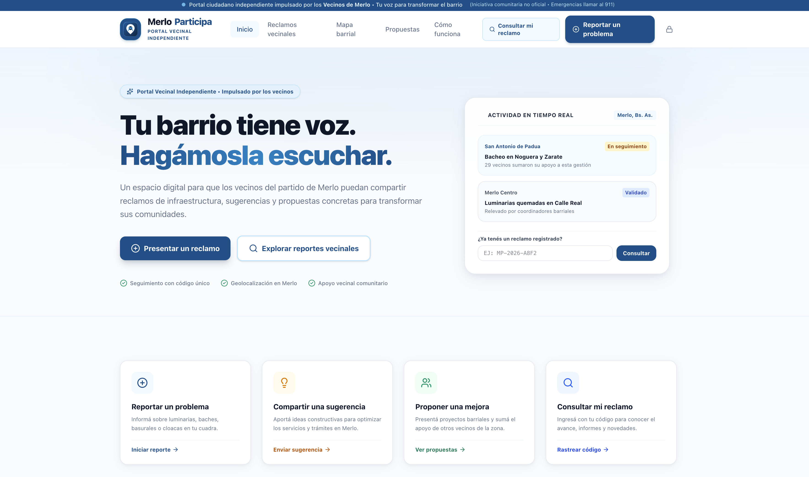
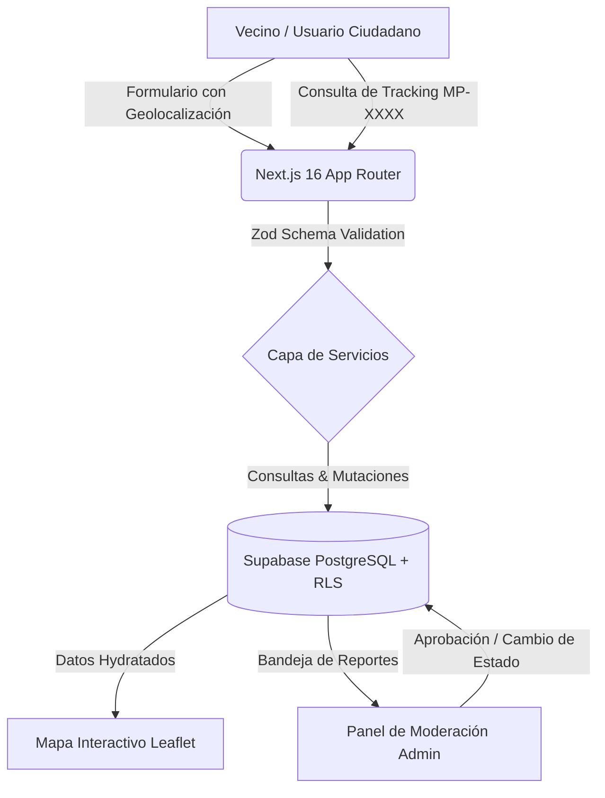

<div align="center">

# 🏛️ Merlo Participa
### Portal Vecinal y Plataforma Cívica de Gestión de Reclamos Urbanos

Plataforma cívica independiente para reporte, geolocalización y seguimiento de problemáticas barriales, reclamos de infraestructura y propuestas comunitarias para el municipio de Merlo.



[](https://nextjs.org/)
[](https://react.dev/)
[](https://www.typescriptlang.org/)
[](https://tailwindcss.com/)
[](https://supabase.com/)
[](https://leafletjs.com/)

[🌐 **Demo en Vivo**](https://merlo-participa.vercel.app) • [💼 **Portafolio del Autor**](https://arsabot.github.io)

---

</div>

## 📌 Descripción General

**Merlo Participa** es una solución de CivicTech diseñada para cerrar la brecha entre la comunidad vecinal y la gestión urbana. Permite a los ciudadanos reportar problemas en la vía pública (bacheo, luminarias rotas, poda y arbolado, acumulación de residuos, problemas de cloacas y seguridad vial) con georreferenciación en mapa, adjuntar evidencias fotográficas y obtener un código de seguimiento alfanumérico para monitorear el estado del reclamo en tiempo real.

Cuenta además con un **panel administrativo de moderación** que permite al equipo auditor aprobar reportes, gestionar estados (*Pendiente*, *En Proceso*, *Resuelto*), alternar visibilidad pública y emitir resoluciones.

---

## 🚀 Características Principales

### 1. 📝 Sistema de Reclamos y Propuestas Vecinales
- **Categorización Inteligente**: Bacheo y Pavimentación, Alumbrado Público, Arbolado y Espacios Verdes, Residuos y Basura, Tránsito y Seguridad Vial, Agua y Cloacas.
- **Geolocalización Automática**: Detección de ubicación o selección manual interactiva en el mapa.
- **Adjuntos de Evidencia**: Soporte para adjuntar imágenes y documentación visual del incidente.
- **Código de Seguimiento Único**: Generación instantánea de tickets (`MP-XXXXXX`) para consulta ciudadana sin necesidad de inicio de sesión obligatorio.

### 2. 🗺️ Mapa Interactivo en Tiempo Real
- Visualización dinámica de incidentes y reclamos barriales con **Leaflet** y tiles optimizados.
- Filtrado dinámico por categoría, localidad (Merlo Centro, Padua, Libertad, Pontevedra, Mariano Acosta, Parque San Martín) y estado.
- Popups informativos con vista previa, fotos y enlace directo al detalle.

### 3. 🛡️ Panel de Moderación y Administración
- **Bandeja de Entrada Auditora**: Vista de reclamos pendientes de aprobación y aprobados.
- **Control de Visibilidad**: Toggle público/privado para evitar publicaciones inapropiadas o duplicadas.
- **Gestión de Estados**: Transición ágil de reportes (*Pendiente* ➔ *En Proceso* ➔ *Resuelto*).
- **Gestión Segura de Accesos**: Flujo de recuperación de contraseñas, cambio seguro de credenciales y protección contra enumeración de usuarios.

### 4. 🔍 Búsqueda y Seguimiento Transparente
- Motor de búsqueda por código alfanumérico, palabra clave o localidad.
- Historial de estados y trazabilidad completa del ciclo de vida del reclamo.

---

## 🛠️ Stack Tecnológico

| Capa | Tecnología | Propósito |
| :--- | :--- | :--- |
| **Framework** | Next.js 16 (App Router) | Renderizado SSR/SSG, Server Components y optimización SEO |
| **Biblioteca UI** | React 19 | Interfaces reactivas y componentes interactivos |
| **Lenguaje** | TypeScript 5 | Tipado estático estricto y type safety de extremo a extremo |
| **Estilos** | Tailwind CSS v4 | Sistema de diseño moderno, tema adaptable y diseño responsive |
| **Mapas** | Leaflet & React-Leaflet | Visualización geoespacial interactiva de reportes barriales |
| **Base de Datos** | Supabase (PostgreSQL) | Persistencia relacional, políticas Row Level Security (RLS) |
| **Validación** | Zod | Validación de esquemas y sanitización de formularios |
| **Iconografía** | Lucide React | Iconos vectoriales accesibles |

---

## 🏛️ Diagrama de Arquitectura



---

## ⚙️ Instalación y Configuración Local

### Prerrequisitos
- Node.js 20+
- npm, pnpm o yarn

### Pasos

1. **Clonar el repositorio:**
   ```bash
   git clone https://github.com/arsabot/merlo-participa.git
   cd merlo-participa
   ```

2. **Instalar dependencias:**
   ```bash
   npm install
   ```

3. **Configurar variables de entorno:**
   Crea un archivo `.env.local` en la raíz del proyecto:
   ```env
   NEXT_PUBLIC_APP_URL=http://localhost:3000
   NEXT_PUBLIC_SUPABASE_URL=tu_supabase_url
   NEXT_PUBLIC_SUPABASE_ANON_KEY=tu_supabase_anon_key
   ```

4. **Ejecutar el servidor de desarrollo:**
   ```bash
   npm run dev
   ```
   Abre [http://localhost:3000](http://localhost:3000) en tu navegador.

5. **Construir para producción:**
   ```bash
   npm run build
   npm run start
   ```

---

## 👨‍💻 Autor

Desarrollado por **Rodrigo Saavedra (@arsabot)** — Full Stack Web Developer.

- 🌐 **Portafolio:** [https://arsabot.github.io](https://arsabot.github.io)
- 💼 **LinkedIn:** [Rodrigo Saavedra](https://www.linkedin.com/in/rodrigo-saavedra-bb2629152/)
- 📱 **WhatsApp:** [+54 9 11 3509-4661](https://wa.me/5491135094661)
- 🐙 **GitHub:** [@arsabot](https://github.com/arsabot)

---

## 📄 Licencia

Este proyecto está bajo la Licencia MIT. Consulta el archivo `LICENSE` para más detalles.
